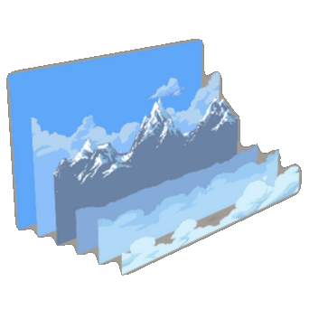

# JKS Tools2D - Parallax Background

[](https://github.com/JavaKhanStudio/JKS_Tools2D_ParallaxBackground/actions/workflows/ci.yml)
[](https://central.sonatype.com/artifact/io.github.javakhanstudio/parallax-background)
[](LICENSE)

A parallax background library for [libGDX](https://libgdx.com) games, and a desktop editor to build those
backgrounds visually.

You compose a parallax in the **editor** from an atlas and/or PNG images, tune each layer while it scrolls, then
export a `.plax` file. Your game loads that file with the **core** library, which scrolls, tiles and draws the layers
behind your game.

## Get it

### The library, for your game

The library is on Maven Central as `io.github.javakhanstudio:parallax-background`. The badge above shows the latest
version. Nothing needs downloading by hand: your build fetches it.

In a libGDX project (as generated by [gdx-liftoff](https://github.com/libgdx/gdx-liftoff)), add it to the `core`
module, in `core/build.gradle`, and make sure `mavenCentral()` is among the repositories (liftoff projects already
declare it):

```groovy
repositories {
    mavenCentral()
}

dependencies {
    implementation "io.github.javakhanstudio:parallax-background:2.2.0"
}
```

Gradle Kotlin DSL (`build.gradle.kts`):

```kotlin
dependencies {
    implementation("io.github.javakhanstudio:parallax-background:2.2.0")
}
```

Maven (`pom.xml`):

```xml
<dependency>
    <groupId>io.github.javakhanstudio</groupId>
    <artifactId>parallax-background</artifactId>
    <version>2.2.0</version>
</dependency>
```

It brings in libGDX (`gdx`), Kryo and the Jackson annotations. It is compiled for Java 11. Your game still declares its
own libGDX backend (LWJGL3, Android...) as usual. The jar, its sources and its javadoc are also attached to each
[GitHub release](https://github.com/JavaKhanStudio/JKS_Tools2D_ParallaxBackground/releases/latest), but then you have
to add those dependencies yourself.

Then see [Using the library in a game](#using-the-library-in-a-game).

### The editor, to design a parallax

Download `ParallaxEditor-<version>.zip` from the
[latest release](https://github.com/JavaKhanStudio/JKS_Tools2D_ParallaxBackground/releases/latest), unzip it and run
`bin/ParallaxEditor` (`bin\ParallaxEditor.bat` on Windows). It includes the library and the sample projects, and
needs Java 17 or newer.

## Build and run

To build from source instead, the repository has three Gradle modules:

| Module   | What it is                                                                                  |
|----------|---------------------------------------------------------------------------------------------|
| `core`   | Runtime library for games: loads `.plax` files, scrolls, tiles and draws the layers.        |
| `editor` | The Parallax Editor (desktop, LWJGL3 + VisUI).                                               |
| `demo`   | A minimal game using `core`: a winter and a spring page cross-faded on demand.               |

Requirements: JDK 17 or newer. The Gradle wrapper downloads Gradle itself.

```bash
./gradlew :editor:run           # the editor, opens on the sample projects in editor/Files
./gradlew :demo:run             # the demo: SPACE switches page, N tints, LEFT/RIGHT scroll, R resets
./gradlew test                  # file format, tiling, cross-fade and no-allocation-per-frame tests
./gradlew :demo:stress --args="--layers 400 --repeat xy"   # frame time of generated pages, see ParallaxStress
./gradlew :editor:installDist   # standalone editor in editor/build/install/ParallaxEditor
```

Versions (libGDX, VisUI, Kryo, Jackson) are set in `gradle.properties`.

## Concepts

A **page** (`WholePage_Model`) is one complete background:

- **Layers**, stored back to front. Each layer is one image (an atlas region) with its own settings.
- **Two gradient squares** (`SquareBackground`) drawn behind the layers, one covering the top of the screen and one
  the bottom, each going from a bottom color to a top color.
- **Repeat on X / Y**: whether layers are tiled horizontally, vertically, both, or drawn once.
- **Original size** (`useOriginalSize`): for an atlas packed with its whitespace stripped (TexturePacker's default),
  whether a layer takes the region's original size and draws the packed image at its offset inside it, as libGDX's
  `AtlasSprite` does. Pages the editor creates have it on. Pages saved before `.plax` format 4 have it off: their
  stripped regions are stretched over the whole layer, the look they were designed with, and they keep it when
  re-saved. The editor's own export (flatten) strips whitespace only on pages that have it on, and packs the others
  whole.

Layers live in **world units**: the world is 40 units wide and its height follows the screen aspect ratio. A layer is
`40 x sizeRatio` units wide, and its height follows the image aspect ratio. Its settings:

| Setting                  | Effect |
|--------------------------|--------|
| Size ratio               | Width of the layer relative to the world width. |
| Decal X / Decal Y        | Starting offset, in percent of the world width / height. |
| Speed ratio X / Y        | How much of the scroll speed the layer follows. Small values = far away, large values = close. |
| At rest speed            | Horizontal speed of the layer even when the screen does not move (clouds, water). |
| Pad X / Pad Y            | Gap between two repetitions of the layer, in world units. |
| Flip X / Flip Y          | Mirror the image. |
| Mirror                   | Adds a flipped copy next to the strip. |

Each frame, a layer moves by `delta × (screen speed + at rest speed) × speed ratio`, then is tiled to cover the
camera view. The screen speed is set by the game, as a constant speed plus a speed consumed by the next frame.

The square sizes are stored as the part of the screen they leave **uncovered**: `0.5` covers half the screen, `0`
all of it, `1` nothing.

## Using the library in a game

Add the library first, see [Get it](#get-it).

To try an unreleased version, see [RELEASING.md](RELEASING.md): pushes to `develop` publish a `-SNAPSHOT`, and
`./gradlew :core:publishToMavenLocal` installs your own build locally.

Put the exported `.plax` file in your assets, and the atlas it names at the root of your assets (the atlas is loaded
through the libGDX `AssetManager` returned by `Gvars_Parallax.getManager()`):

```java
Parallax_Heart heart;

public void create() {
    heart = new Parallax_Heart("backgrounds/forest.plax");  // owns its camera and batch
    heart.screenSpeedConstantX = 60;                        // optional: always scroll
}

public void render() {
    heart.screenSpeedConsumableX = player.speedX;           // scroll for this frame only
    heart.act(Gdx.graphics.getDeltaTime());
    heart.render();                                         // draw it before your game
}

public void resize(int width, int height) { heart.resize(width, height); }

public void dispose() {
    heart.dispose();
    Gvars_Parallax.getManager().dispose();                  // the atlases
}
```

More:

- **Change page with a cross-fade:** `heart.transfertIntoPage(Utils_Page.loadPage("backgrounds/night.plax"), 3f)`.
  Layers are matched from the front, and matching layers keep scrolling seamlessly. This works best between variants
  of the same scene (day/night, winter/spring).
- **Tint every layer:** `heart.parallaxReader.addColorTransfert(color, seconds)`.
- **Use your own camera and batch:** `new Parallax_Heart(camera, batch, worldWidth, worldHeight)`, then `setPage(...)`.
  The layers are laid out from the bottom-left corner of the camera view, so moving the game camera doesn't drag the
  background away.
- **Load an atlas from a folder instead of the assets:** set `heart.relativePath` before `setPage` (desktop only).
- **Ship to the browser (GWT):** add `<inherits name="jks.tools2d.parallax.Parallax"/>` to your html module and the
  library's `-sources` jar to its classpath. `.plax` files are read with Kryo, which has no browser version: in a
  browser game, load the page's JSON with `Parallax_Heart.fromJson("page.jplax")` (a `.plaxpj` works too, see "File
  formats"), or build the `WholePage_Model` in Java and pass it to `setPage`. `Utils_Page` and
  `new Parallax_Heart(path)` are not there.
- **Performance:** `act` and `render` allocate nothing, and the game thread spends under a millisecond on 400 layers.
  What costs is the GPU filling pixels: every layer is blended over the ones behind it, and a cross-fade draws both
  pages. Fewer and smaller layers are what counts. The editor exports atlases with mipmaps (`filter:
  MipMapLinearLinear,Linear`) on pages whose sides are powers of two: 200 screen-wide layers draw a third faster (24.7 ms
  to 17.0 ms on an Intel iGPU). An atlas you pack yourself gets the same by setting that filter, but only on
  power-of-two pages if the game runs on OpenGL ES 2 or WebGL 1 (Android, the browser): those draw any other mipmapped
  texture black. A cross-fade between pages on two different atlases also flushes the batch once per layer.

Each `Parallax_Heart` keeps its own world size (`heart.getWorldWidth()`, `getWorldHeight()`), so hearts of different
sizes can run side by side. `Gvars_Parallax` only holds the size of the last heart built, the default for layers and
pages built without a heart. `demo/` is a complete example.

## Using the editor

### Start screen

Open a project (`.plaxpj`), an exported parallax (`.plax` or `.jplax`), or an atlas (`.atlas`) to start a project
from it. **NEW** starts an empty project. Files can also be dragged onto the window.

### Edition screen

- **Center:** the live preview. Use play/pause, full screen, the X/Y speed sliders and "Reset position".
  Arrows/WASD (and space) scroll it by hand.
- **Top:** project folder and name. The two save buttons are **Save project** (`.plaxpj`) and **Export** (`.plax` and/or
  `.jplax`, see the format checkboxes).
- **Left tabs:**
  - **Controls:** help and tutorial links; **Parallax** (repeat on X/Y, current atlas, copy loose images next to the
    project, back to the start screen); **Application** (window size, full screen, VSync).
  - **Add texture:** **Adding new** is the list of images. The selected image has three buttons: *add it as a layer*,
    *make the layers of this image use another one*, and *delete it*. **Default Value** sets the settings of the
    next added layer, and how they change after each addition (speeds are multiplied, the rest is added), which
    quickly builds a stack of layers with depth.
  - **Textures:** every setting of the selected layer: its position in the stack, clone, set as default, delete/undo,
    flips, and the sliders. The arrow buttons next to a slider copy that value from the layer in front / behind.
  - **Background:** the top and bottom squares: on/off, size, and both colors, with an eyedropper that picks a color
    from the preview (right click cancels it).

The mouse wheel changes the slider under the mouse. Over a slider's number field, it changes the digit left of the
text cursor.

### Loose images and export

Drop PNG files on the edition screen to add them without an atlas. They reload automatically when you save them from
an image editor. When you export a project that uses loose images (or with **F.Export** checked), the editor first
**flattens** it: every image of the list is packed into a new atlas next to the project (`<name>.atlas` plus
`<name>_1.png`, `<name>_2.png`...), and the project then uses that atlas.

The project is auto-saved every 5 minutes into `Files/AutoSave` (or `~/.parallax-editor/autosave` when the editor is
not started from its module folder). The 10 most recent auto-saves are kept.

### Driving the editor from another program

`--driver-port=N` lets a script drive the editor, for demos and narrated videos. It is off unless you pass the flag,
and it listens on `127.0.0.1` only:

```bash
./gradlew :editor:run --args="--driver-port=47777 Files/Demos/OneNight.plaxpj"
echo "click tab.textures" | nc 127.0.0.1 47777
```

It reads one command per line and answers each one with `ok ...` or `err ...`. `list` gives the named controls on screen
with their bounds, `bounds`, `click`, `set` and `wheel` act on one control, `open` loads a file, and `shot` writes the next
frame to a PNG. `fps` gives the frame rate and render-thread time over the last 120 frames. A control is found by its name (`texture.sizeRatio`, `tab.background.topSquare`), or by its text with
`text:Yes`. The full list is in `EditorDriver`'s javadoc. A resize rebuilds the panels and puts every tab back on its
first, so commands wait for that rebuild. Set the window size before the demo, not during it. `tools/driver-probe.sh`
starts the editor off screen, sends it the commands it reads, and stops it.

To profile the editor on a heavy page, `tools/stress-project.py 300` writes a 300-layer project in
`editor/build/stress`, and `tools/editor-stress.txt` is a session of edits, save and export to replay on it:

```bash
(echo "open build/stress/Stress300.plaxpj"; cat tools/editor-stress.txt) | PROBE_TIMES=1 tools/driver-probe.sh
```

## File formats

| Extension | Content                                              | Written by    | Read by                   |
|-----------|------------------------------------------------------|---------------|---------------------------|
| `.plax`   | Exported page, Kryo binary                           | Export        | games (`Utils_Page`), editor |
| `.jplax`  | Exported page, JSON (Jackson)                        | Export        | browser games (`Utils_Page_Json`), editor, other tools |
| `.plaxpj` | Project: page, loose images, default values (JSON)   | Save project  | editor, browser games (`Utils_Page_Json`) |

A page references its atlas by file name, and looks for it next to itself. **Save project** therefore copies the atlas
and its page images into the project folder when they are not there yet, and refuses to save if that folder already
holds different files of the same name. A project saved away from the folder it was opened from stores its loose
images by absolute path; auto-saves store the atlas that way too. Layers reference an image by region name and position
among the regions that share that name.

A browser (GWT) game cannot read `.plax` (Kryo): it loads the JSON of a page instead, with
`Parallax_Heart.fromJson("page.jplax")` or `Utils_Page_Json.loadPage(file)`. That reader takes a `.jplax` or a
`.plaxpj`; of a project it keeps the layers an export would keep, the ones drawn from the atlas.

`.plax` files carry a format version since 2.0. Format 2 also stores `flipY`, format 3 `mirror` and format 4 the
page's `useOriginalSize`; format 1 files (written by the 2019-2023 editor) and formats 2 and 3 still load, with
`useOriginalSize` off, as do `.jplax` and `.plaxpj` files without it. `core/test/.../PlaxFormatTest` checks every sample file against the project it was
exported from. Kryo registration order defines the class ids stored in the files, so `GVars_Serialization.prepareKryo`
must only ever be appended to.

## Code map

```
core/src/jks/tools2d/parallax/       translatable by GWT (Parallax.gwt.xml)
    heart/Parallax_Heart          entry point: camera, batch, squares, act/render/resize/dispose
    heart/Parallax_Utils_Page     set a page, cross-fade into another one
    heart/Gvars_Parallax          default world size, AssetManager
    ParallaxPageReader            scrolling, tiling, cross-fade and tint of the layers
    ParallaxLayer                 one layer: image, settings, scroll position
    pages/                        saved models (WholePage_Model, Page_Model, Parallax_Model), Utils_Page_Json (load JSON)
    side/SquareBackground         the gradient squares
core/src-jvm/jks/tools2d/parallax/   same packages and jar, JVM only
    heart/GVars_Serialization     Kryo setup for .plax
    pages/                        Kryo serializers, Utils_Page (load a .plax), Json_MixIns (Jackson setup)
core/gwt-check/                   what :core:gwtCheck compiles to JavaScript

editor/mains/.../Launcher_Editor  desktop launcher (window, file drops)
editor/src/jks/tools2d/
    amains/Main_Editor            application: switches between the two screens
    parallax/editor/vue/          Vue_Selection (start screen), Vue_Edition (edition screen)
    parallax/editor/vue/edition/  the panels (VE_*), project data, save/export/flatten utilities, atlas packer
    parallax/editor/gvars/        editor-wide state, paths, UI skin and fonts, JSON setup
    parallax/editor/driver/       EditorDriver (--driver-port), Names (the controls' names)
    filechooser/ filewatch/ libgdxutils/   file browser, file watcher, small scene2d widgets

demo/src/.../ParallaxDemo         example game
```

The editor keeps its state in static `GVars_*` classes, one project at a time. The panels read the window size when
they are built, so the edition screen rebuilds them after a resize.

## Contributing and releases

Work happens on `develop`, releases are tagged on `master`, and CI builds every push and pull request on JDK 17, 21
and 25. [RELEASING.md](RELEASING.md) describes the branches, how to cut a release and the one-time Maven Central
setup.

## License

Apache License 2.0, see [LICENSE](LICENSE).

## Credits

Started in 2017 as a fork of [ParallaxBackground-libgdx](https://github.com/fooble/ParallaxBackground-libgdx) by
**Rahul Verma**, Copyright 2014, licensed under the Apache License 2.0. See [NOTICE](NOTICE) for the other
third-party code included in the editor.
